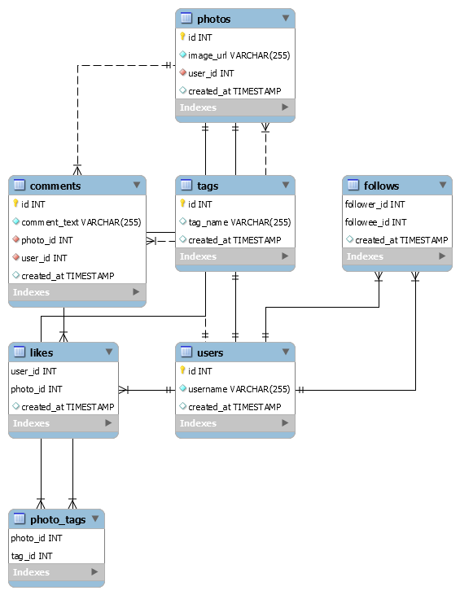

# Instagram_Database_clone
### In this repository, you can see an attempt to make a kind of instagram database with some operations!!!
The explanation of this project will be divides in 3 parts:
1. Tables databases flow chart
2. Functions
3. Packages and Programs

1) **Tables**

2) **Functionalities**
  1. Insert a data or many data in once to any table 
      >users \
      >photos \
      >likes \
      >comments \
      >follows \
      >tags \
      >photo_tags 
      
  2. Delete a data from any table
  3. Find the five oldest users registrated in the system
  4. Find the most common day for people to register
  5. Find the users who do not post a photo (inactive)
  6. Find the photos with more likes
  7. Bring the count of Photos per users
  8. Select the most commom tags
  9. Select the users that are the most likers
  10. Select the users who comment the most
  
  
3) **What you have to download**

MySQL Workbench | 
------------ |
[MySQL](https://dev.mysql.com/downloads/workbench/) | 
 
Pymysql | 
------------ |
[pip install PyMySQL](https://pypi.org/project/PyMySQL/) | 

:pushpin:**OBS:** I didn't do all the functions you can imagine, because that would be a lot. :sweat_smile:\
                  So, take a good look, understand how to make this connection python-Mysql, learn how do some things with the database, and be happy!:nerd_face:
